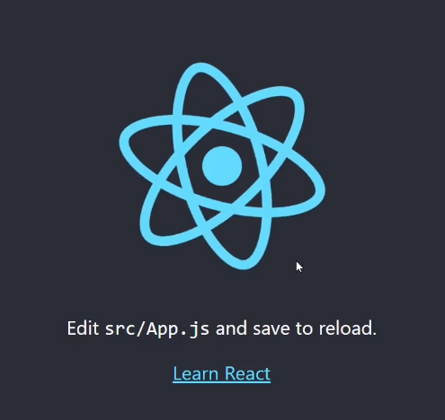
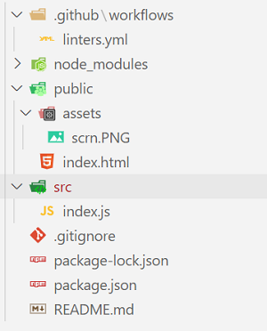

# This is your manual on way of React learning!

### Let`s start!

## Preparation

- Install [Node.js](https://nodejs.org/en/).
- To check, if Node.js is installed already, then just check Node.js and npm versions: `node -v` and `npm -v`
- Instal `React Dev tools` in Google extentions. (we need it for future)

## Install React and start with app

- `npx create-react-app [name of app]` (npx intalled with Node.js) - this process will take time.
- `cd [name of app]` (note: if you created the github repo with README file, then you will have also a new one inside [name of app] folder)
- `npm start` and if you see following screen, then you are on right way.
 
- Set linter in folder `/.github/workflows/` in file `linters.yml` ([here is the link to file](https://github.com/elmar8287/react_redux_tuto/blob/dev/.github/workflows/linters.yml)).
- Clear `public` folder exept `index.html` file.
- Clear `src` folder exept `index.js` file. (you will have something like this)
 
### We can start
- To create a production build, use `npm run build` 