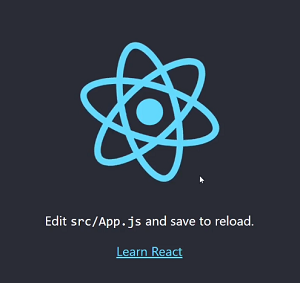

# This is your manual on way of React learning!

### Let`s start!

## Preparation

- Install [Node.js](https://nodejs.org/en/).
- To check, if Node.js is installed already, then just check Node.js and npm versions: `node -v` and `npm -v`
- Instal `React Dev tools` in Google extentions. (we need it for future)

## Install React and start with app

- `npx create-react-app [name of app]` (npx intalled with Node.js) - this process will take time.
- `cd [name of app]` (note: if you created the github repo with README file, then you will have also a new one inside [name of app] folder)
- `npm start` and if you see following screen, then you are on right way.
  
- Set linter in folder `/.github/workflows/` in file `linters.yml` ([here is the link to file](https://github.com/elmar8287/react_redux_tuto/blob/dev/.github/workflows/linters.yml)).
- Clear `public` folder exept `index.html` file.
- Clear `src` folder exept `index.js` file. (you will have something like this)
  
### We can start

- You shoul use `import React from 'react'` everywhere `jsx` using
- Use arrow functions
- Div the app to components
- Use Uppercase when give a name for a component 
- Keep all components in folder `src/components`
- Give name for components using `kebab style`, aka sample-sample-etc...
- In each component do not forget make export `export default [component name]`
- Do not forget to `import` all components in `index.js` file
- If the jsx code is in one simple line, then parancetes do not need, other case the code should be inside of `(`...`)`
- React elements could be added into any component with using `{`...`}`
- All atributes should have the name considering camelCase ( arrItem, sampleSample, etc... )
- All `jsx` atributes have the same name as in `HTML`, exept `className` (it is class in HTML) and `htmlFor` (it is for loop in html)
- Use spread operators https://www.educative.io/edpresso/what-is-the-spread-operator-in-javascript
- Give ID for your elements, because React need to know what to update - for fast updating
- Call your `CSS` files as the name of components
- Make refactoring: insert each component in folder called like component (maybe webpack need to restart `npm start`)

- To create a production build, use `npm run build` 

- the demo live link: https://react-reduc-tutorial.netlify.app/